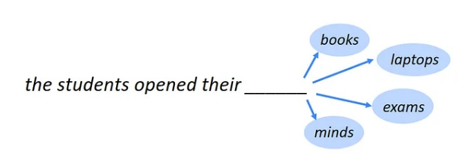

    

<h1 align="center">Language Modeling</h1>

Language modeling is one of the benchmark tasks of NLP. In its simplest form, it consists of predicting the most probable word following a series of words based on them. The purpose of language modeling is to create and train a model that generates a meaningful expression. In such a way that it takes an incomplete sentence and by adding words to the end of it, presents a complete and coherent sentence with a concept that can be understood.

## 1. Problem Statement
In this section, you'll find a comprehensive overview of the problem being addressed in the project.

## 2. Related Works
This section explores existing research and solutions related to medical image segmentation. 

## 3. The Proposed Method
Here, the proposed approach for solving the problem is detailed. It covers the algorithms, techniques, or deep learning models to be applied, explaining how they address the problem and why they were chosen.

## 4. Implementation
This section delves into the practical aspects of the project's implementation.

### 4.1. Dataset
Under this subsection, you'll find information about the dataset used for the medical image segmentation task. It includes details about the dataset source, size, composition, preprocessing, and loading applied to it.
[Dataset](https://www.kaggle.com/competitions/uw-madison-gi-tract-image-segmentation/data)

### 4.2. Model
In this subsection, the architecture and specifics of the deep learning model employed for the segmentation task are presented. It describes the model's layers, components, libraries, and any modifications made to it.

### 4.3. Configurations
This part outlines the configuration settings used for training and evaluation. It includes information on hyperparameters, optimization algorithms, loss function, metric, and any other settings that are crucial to the model's performance.

### 4.4. Train
Here, you'll find instructions and code related to the training of the segmentation model. This section covers the process of training the model on the provided dataset.

### 4.5. Evaluate
In the evaluation section, the methods and metrics used to assess the model's performance are detailed. It explains how the model's segmentation results are quantified and provides insights into the model's effectiveness.
