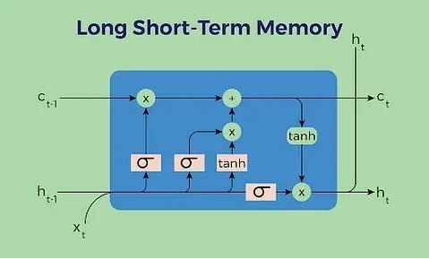

    

<h1 align="center">Language Modeling</h1>

## 1. Problem Statement
Language modeling is a fundamental task in natural language processing (NLP) that involves predicting the next word in a sequence given the preceding words. The purpose of language modeling is to create and train a model that generates a meaningful expression. In such a way that it takes an incomplete sentence and by adding words to the end of it, presents a complete and coherent sentence with a concept that can be understood.

This task is crucial for various applications, including text generation, speech recognition, machine translation, and more. Recent advances in language modeling have been driven by large-scale pre-trained models like BERT, GPT-3, and their successors. These models are trained on vast datasets and can be fine-tuned for various specific tasks, demonstrating remarkable capabilities in understanding and generating human-like text. The shift from traditional statistical models to sophisticated neural architectures has led to significant improvements in the ability of machines to understand and generate human language.

## 2. Related Works
This table summarizing the current methods in language modeling, including the deep learning models used and relevant links to papers or GitHub repositories.

| Date       | Title                                  | Description                                                                                                      | Links                                                                                                                                                          |
|------------|----------------------------------------|------------------------------------------------------------------------------------------------------------------|---------------------------------------------------------------------------------------------------------------------------------------------------------------|
| 2017       | Attention Is All You Need              | Introduction of the Transformer model, which uses self-attention mechanisms for language modeling.                | [Paper](https://arxiv.org/abs/1706.03762), [GitHub](https://github.com/tensorflow/tensor2tensor)  
| 2018       | ULMFiT: Universal Language Model Fine-tuning for Text Classification |  Applies transfer learning with LSTM for various NLP tasks, including language modeling and text completion.  | [Paper](https://arxiv.org/abs/1801.06146), [GitHub](https://github.com/fastai/fastai)
| 2018       | BERT: Pre-training of Deep Bidirectional Transformers for Language Understanding | BERT (Bidirectional Encoder Representations from Transformers) pre-trains deep bidirectional representations.     | [Paper](https://arxiv.org/abs/1810.04805), [GitHub](https://github.com/google-research/bert)                                                                  |
| 2019       | XLNet: Generalized Autoregressive Pretraining for Language Understanding | Combines the strengths of autoregressive and autoencoding models for better performance in language tasks.        | [Paper](https://arxiv.org/abs/1906.08237), [GitHub](https://github.com/zihangdai/xlnet)                                                                       |
| 2019       | RoBERTa: A Robustly Optimized BERT Pretraining Approach | Optimizes BERT by training longer with larger mini-batches and more data.                                         | [Paper](https://arxiv.org/abs/1907.11692), [GitHub](https://github.com/pytorch/fairseq/tree/main/examples/roberta)                                            |
| 2020       | GPT-3: Language Models are Few-Shot Learners | GPT-3 (Generative Pre-trained Transformer 3) with 175 billion parameters, enabling few-shot learning capabilities. | [Paper](https://arxiv.org/abs/2005.14165)                                                                                                                     |
| 2020       | T5: Exploring the Limits of Transfer Learning with a Unified Text-to-Text Transformer | Proposes a unified framework for NLP tasks using the Text-to-Text Transfer Transformer (T5).                      | [Paper](https://arxiv.org/abs/1910.10683), [GitHub](https://github.com/google-research/text-to-text-transfer-transformer)                                      |
| 2020       | Reformer: The Efficient Transformer    | Improves the efficiency of Transformer models using locality-sensitive hashing and reversible layers.              | [Paper](https://arxiv.org/abs/2001.04451), [GitHub](https://github.com/google-research/reformer)                                                              |
| 2021       | GPT-Neo: Large Scale Autoregressive Language Modeling with Mesh-Tensorflow | Open-source replication of GPT-3 architecture.                                                                    | [GitHub](https://github.com/EleutherAI/gpt-neo), [Paper](https://arxiv.org/abs/2104.08407)                                                                    |
| 2021       | BART: Denoising Sequence-to-Sequence Pre-training for Natural Language Generation, Translation, and Comprehension | BART (Bidirectional and Auto-Regressive Transformers) combines bidirectional and autoregressive approaches.       | [Paper](https://arxiv.org/abs/1910.13461), [GitHub](https://github.com/facebookresearch/fairseq/tree/main/examples/bart)                                       |
| 2021       | Switch Transformers: Scaling to Trillion Parameter Models | Introduces a mixture of experts model to efficiently scale to trillion parameters.                                 | [Paper](https://arxiv.org/abs/2101.03961), [GitHub](https://github.com/tensorflow/lingvo/tree/master/lingvo/core/gshard)                                       |
| 2022       | LaMDA: Language Models for Dialog Applications | Optimizes dialogue applications using open-domain dialogue pre-training.                                           | [Paper](https://arxiv.org/abs/2201.08239)                                                                                                                     |
| 2022       | PaLM: Scaling Language Modeling with Pathways | Utilizes the Pathways system to efficiently train models with up to 540 billion parameters.                        | [Paper](https://arxiv.org/abs/2204.02311)                                                                                                                     |
| 2023       | ChatGPT: Optimizing Language Models for Dialogue | ChatGPT improves interaction in dialogues using reinforcement learning from human feedback (RLHF).                 | [Blog](https://openai.com/blog/chatgpt), [GitHub](https://github.com/openai/gpt-3)                                                                            |

This table and the detailed descriptions provide a comprehensive overview of the current state of language modeling in NLP, highlighting the most significant models and methods along with their corresponding resources.

## 3. The Proposed Method
Long Short-Term Memory (LSTM)
Basic Explanation:
Long Short-Term Memory (LSTM) is a type of recurrent neural network (RNN) architecture designed to effectively capture long-term dependencies in sequential data. Traditional RNNs struggle with long-term dependencies due to the vanishing gradient problem, where gradients become very small and stop the learning process during backpropagation. LSTMs address this issue by using a more complex architecture that includes:

1. **Cell State:** A direct path that allows information to flow unchanged.
2. **Gates:** Mechanisms to control the flow of information:
   - **Forget Gate:** Decides what information to throw away from the cell state.
   - **Input Gate:** Decides which values from the input to update the cell state.
   - **Output Gate:** Decides what part of the cell state to output.

This architecture allows LSTMs to maintain and update information over long sequences, making them suitable for tasks like language modeling and text generation.
 

   

### Embedding Models

Embedding models are used to convert categorical data, particularly text, into continuous vectors in a high-dimensional space. These vectors capture the semantic meaning of the words, where words with similar meanings are located closer together in the vector space. Word embeddings help transform textual data into a format that can be easily processed by machine learning algorithms.

### Combining LSTM, Embedding, and Fully Connected layers for Language Modeling

When using LSTM for language modeling or text completion, an embedding layer is often used as the first layer to convert input words into dense vectors. These embeddings are then fed into the LSTM, which processes the sequence and generates predictions.

**Used Architecture:**
1. **Embedding Layer:** Converts input words into dense vectors.
2. **LSTM Layer(s):** Processes the sequence of embeddings to capture dependencies.
3. **Fully Connected Layer:** Maps the LSTM outputs to the desired output space (e.g., vocabulary size for next word prediction).

   

This example demonstrates a basic LSTM model for language modeling, where the embedding layer converts words to dense vectors, and the LSTM processes these vectors to predict the next word in the sequence.

## 4. Implementation
This section delves into the practical aspects of the project's implementation.

### 4.1. Dataset
Under this subsection, you'll find information about the dataset used for Language Modeling task. It includes details about the dataset source, size, composition, preprocessing, and loading applied to it.

The WikiText-2 dataset is a popular benchmark dataset for language modeling tasks. This dataset is more representative of modern English, containing long-term dependencies and requiring a deep understanding of context for accurate predictions. You can load the WikiText-2 dataset using libraries such as [torchtext](https://paperswithcode.com/dataset/wikitext-2) or download from [kaggle](https://www.kaggle.com/datasets/rohitgr/wikitext?select=wikitext-2).

In this work, I downloaded it from kaggle contains 3 splits called **wiki.train.tokens**, **wiki.valid.tokens**, and **wiki.test.tokens** each of which consists of approximately:

- **Train Split:** 36718 lines

- **Validation Split:** 3760 lines

- **Test Split:** 4358 lines

If you need a rough estimate, here are the approximate token counts based on the original dataset documentation:

- **Train Split:** Approximately 2,088,628 tokens

- **Validation Split:** Approximately 217,646 tokens

- **Test Split:** Approximately 245,569 tokens

**Tokenizing**

For tokenizing the dataset, I used a simple generator method using **yield**. It reads every line from determined dataset split, tokenize, and , make vocabulary by pytorch build_vocab_from_iterator function.

    def text_read_iterator(token_path ):
      with io.open(token_path, encoding = 'utf-8') as f:
        for line in f:
          yield line
          
    tokenizer= get_tokenizer('basic_english')

    vocabs = build_vocab_from_iterator(map(tokenizer,text_read_iterator('/content/wikitext-2/wiki.train.tokens')),min_freq=1, specials=["<unk>"])

### 4.2. Model
Here, the architecture and specifics of the deep learning model employed for the language modeling task are presented. It describes the model's layers, components, libraries, and any modifications made to it.

in this project, a simple LSTM-based custom model is created. this model consists of three parts:

- **an embedding layer**
- **an LSTM layer**
- **a fully connected layer**

Overal structure of custom model is as below but you can find detailed structure in **language_modeling.ipynb** file.

    class LanguageModel(nn.Module):
        def __init__(self, vocab_size, embedding_dim, hidden_dim, num_layers, dropout_embd=0.5, dropout_rnn=0.5):
            super(LanguageModel, self).__init__()
            self.embedding = nn.Embedding(vocab_size, embedding_dim)
            self.Embedding.weight.data.uniform_(-0.1,0.1)
            self.dropout= nn.Dropout(p= dropout_embd)
            self.lstm = nn.LSTM(embedding_dim, hidden_dim,num_layers=num_layers, dropout= dropout_rnn, batch_first=True)
            self.fc = nn.Linear(hidden_dim, vocab_size)

### 4.3. Configurations
This part outlines the configuration settings used for training and evaluation. It includes information on hyperparameters, optimization algorithms, loss function, metric, and any other settings that are crucial to the model's performance.

- loss_fn = torch.nn.CrossEntropyLoss()

- metric = torchmetrics.text.Perplexity().to(device)

- optimizer = torch.optim.SGD(model.parameters(),lr=0.5, weight_decay=0, momentum=0.9)

To use GPU we can set device with this code:
- device = 'cuda' if torch.cuda.is_available() else 'cpu'

### 4.4. Train
Here, you'll find instructions and code related to the training of the language model. This section covers the process of training the model on the provided dataset.

The training process consists of Finding Hyper-parameters and Main loop section. in Finding Hyper-parameters section, we used different scenarios to obtain best hyper-parameters like learning rate, weight decay, and, momentum. The result of this section is used to train the model in Main Loop.

I made a grid of LR and WD like below
- learning rate : 5, 3, 0.9, 
- weight decay: 1e-6, 1e-5, 1e-4

The best perplexity= 143.1 for above grid obtained with LR= 3, WD= 1e-6, and momentum=0.9, dropout_rnn=0.2

Then, after training the best model from previous step for another list of learning rates= 2, 0.9, 0.5, 0.3, 0.08,  it showed that LR=0.5 is bether than others.

### 4.5. Evaluate
In the evaluation section, the methods and metrics used to assess the model's performance are detailed. It explains how the model's results are quantified and provides insights into the model's effectiveness.

The best perplexity= 128.7 for validation obtained with LR= 0.5, WD= 1e-6, and momentum=0.9, dropout_rnn=0.2

For further assessments and acheive bether results, we plan to use the state-of-the-art methods in recent articles.
